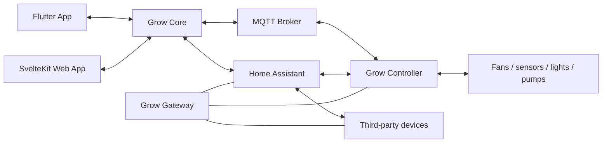
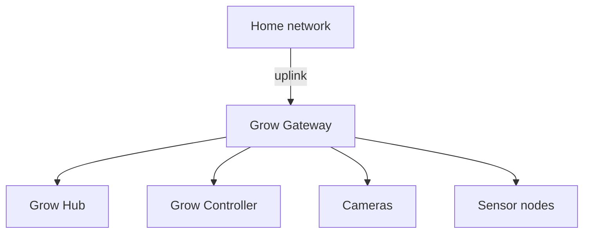

# Architecture

## Overview

GrowRig separates the user experience, grow-domain logic, device compatibility, networking, and physical control.



## Software components

### Grow Core

Recommended implementation:

```text
Language: Go
Storage: SQLite
API: HTTP + WebSocket
Packaging:
  - Home Assistant OS app
  - Docker container
```

Suggested internal modules:

```text
growcore/
├── domain/
│   ├── site
│   ├── environment
│   ├── zone
│   ├── role
│   ├── device
│   ├── recipe
│   └── cycle
├── control/
│   ├── climate
│   ├── ventilation
│   ├── lighting
│   └── irrigation
├── safety/
├── adapters/
│   ├── homeassistant
│   ├── mqtt
│   └── simulator
├── storage/
└── api/
```

Grow Core is a reconciliation engine:

```text
actual state
    +
desired targets
    +
active phase
    +
safety constraints
    ↓
desired device state
```

### Home Assistant

Home Assistant remains responsible for:

- device discovery;
- third-party integrations;
- current device state;
- protocol translation;
- generic notifications;
- existing HA automations where explicitly desired.

Grow Core should not mirror Home Assistant internals directly into its domain model.

### Web app

The web interface is intended for:

- initial configuration;
- role mapping;
- hardware tests;
- recipe editing;
- historical analysis;
- diagnostics;
- backups;
- firmware flashing.

### Mobile app

The Flutter app is intended for:

- daily status;
- alerts;
- QR pairing;
- BLE provisioning;
- quick overrides;
- journal photos;
- offline cached state.

## Controller connectivity

The prototype supports two paths.

### Home Assistant path

```text
Grow Controller
    ↓ ESPHome native API
Home Assistant
    ↓ WebSocket/API
Grow Core
```

This is the easiest DIY path and requires the least custom infrastructure.

### Direct path

```text
Grow Controller
    ↓ MQTT
Grow Core
```

This reduces coupling and allows Grow Core to communicate with the controller even when Home Assistant Core is restarting.

### Hybrid mode

ESPHome can expose both the native API and MQTT.

Grow Core must avoid duplicate ownership. One adapter is selected as authoritative for commands while the other may remain available for visibility or migration.

## Controller responsibility

The Grow Controller should locally handle:

- PWM output;
- tachometer measurement;
- minimum and maximum speed;
- startup boost;
- command timeout;
- fallback state;
- emergency behavior;
- physical override;
- last valid policy.

Grow Core sends intent and policy. It should not need to continuously micromanage every PWM edge.

## Grow Gateway network



The Gateway role can initially be provided by any Wi-Fi router.

Recommended policy:

```text
Grow devices → home LAN      deny
Grow devices → internet      deny by default
Grow Hub → internet          allow selected services
Home LAN → Grow Hub          allow Grow App / HA UI
Home LAN → other grow devices deny
```

## Data ownership

### Home Assistant owns

- raw entity states;
- protocol connectivity;
- device discovery;
- generic history.

### Grow Core owns

- semantic device roles;
- grow environments;
- recipes;
- control policies;
- cycle history;
- alerts and acknowledgements;
- diagnostics;
- journal metadata.

### Grow Controller owns

- current local outputs;
- local safety state;
- last accepted policy;
- offline behavior;
- hardware health.

## Semantic capability model

Grow Core should model capabilities, not brands.

Example:

```yaml
device:
  id: controller-a13f
  type: grow-controller

capabilities:
  - fan.speed
  - fan.rpm
  - sensor.temperature
  - sensor.humidity
  - display.status

channels:
  - id: fan1
    role: exhaust
  - id: fan2
    role: circulation
```

A future device model may align with concepts from Web of Things, but the MVP should remain small and understandable.

## Policy model

Long-term, Grow Core should send versioned policies:

```yaml
policy:
  id: main-box
  version: 42

channels:
  fan1:
    minimum: 20
    maximum: 100
    fallback: 50

safety:
  command_timeout: 60s
  emergency_temperature: 35
  emergency_fan_speed: 100
```

The controller acknowledges and stores the last valid policy.

## Firmware flashing

Grow App can include a specialized GrowRig flasher.

```text
Choose board
    ↓
Choose supported configuration
    ↓
Connect USB
    ↓
Flash prebuilt ESPHome firmware
    ↓
Provision Wi-Fi
    ↓
Register with Grow Core
```

Initial implementation:

- ESP Web Tools;
- prebuilt manifests;
- Improv USB/BLE provisioning;
- optional custom build through ESPHome on the Hub.

## Future architecture directions

- semantic digital twin of each installation;
- policy signing and versioning;
- per-device identity;
- signed and rollback-safe OTA;
- simulator and recorded-data replay;
- hardware-in-the-loop tests;
- structured metrics and diagnostics;
- reproducible releases and SBOMs;
- explainable adaptive control;
- extension SDK for drivers and algorithms.
